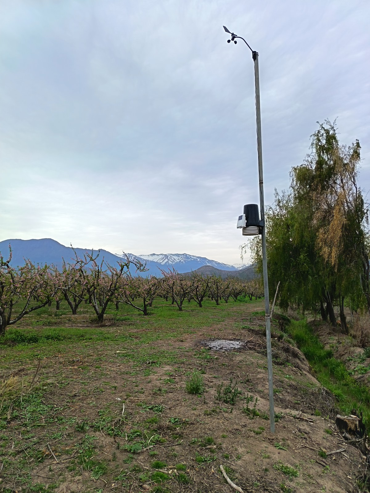
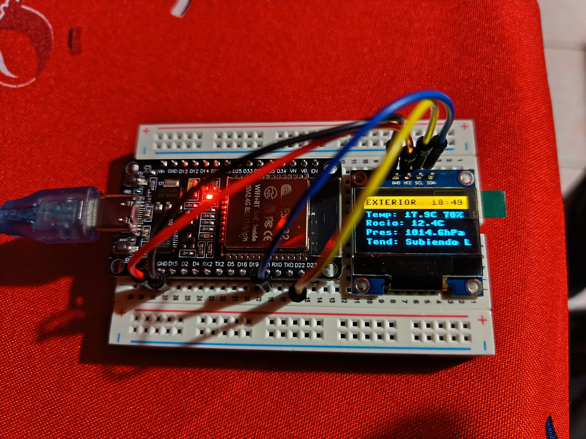

# Davis Vantage Pro 2 — El Gancho (Putaendo, Chile)

Sistema autónomo en tiempo real para recolección, registro y telemetría de todas las variables meteorológicas de la consola **Davis Vantage Pro 2** (vía WeatherLink IP / Serial), almacenamiento continuo en **Google Sheets** (esquema oficial de 41 columnas de WeatherLink PC), base de datos local **CSV** y retransmisión a **Weather Underground** (RapidFire).

Diseñado en **Python puro sin dependencias externas**, lo que permite ejecutarlo de forma idéntica en:
1. **Microcontrolador ESP32** (firmware estándar MicroPython, funcionamiento autónomo 24/7).
2. **PC local** (Windows, Linux, macOS con Python 3).

---

<p align="center">
  
  &nbsp;&nbsp;
  
</p>
<p align="center">
  <em><strong>Izquierda:</strong> Estación meteorológica Davis Vantage Pro 2 ISS en el predio agrícola El Gancho (Putaendo, Región de Valparaíso, Chile).<br>
  <strong>Derecha:</strong> Microcontrolador ESP32 con pantalla OLED SSD1306 (128x64) y LED de estado operando en tiempo real con MicroPython.</em>
</p>

---

## Estación en Vivo

- **Weather Underground:** [`IPUTAE17`](https://www.wunderground.com/dashboard/pws/IPUTAE17) *(Putaendo, Valparaíso, Chile — Lat: -32.63°, Lon: -70.72°)*.
- **Transmisión:** En vivo cada 30 segundos (RapidFire).
- **Sincronización Cloud:** Cada 10 minutos a Google Sheets (esquema WeatherLink PC con 41 columnas).

---

## Arquitectura del Sistema

```
Davis Vantage Pro 2 ISS (Sensores de Campo)
  ↓ [Inalámbrico 868 / 915 MHz]
Consola Davis Vantage Pro 2 + WeatherLink IP (192.168.1.7:22222)
  ↓ [TCP Socket - Paquete LOOP 1 binario de 99 bytes / DMPAFT Archive]
ESP32 MicroPython (o PC Python Core)
  ├── 1. Parser & CRC-16 Checksum (validación estricta de trama)
  ├── 2. Calculador Magnus-Tetens (Punto de rocío de alta precisión)
  ├── 3. WindTracker (ventanas móviles de 2m y ráfagas de 10m)
  ├── 4. Pantalla OLED SSD1306 (Carrusel animado de 7 pantallas con transición vertical)
  ├── 5. Indicador LED de Estado (GPIO 2):
  │       ├── Luz titilante (3 pulsos rápidos): Confirmación de envío a Weather Underground (cada 30s)
  │       └── Luz fija de 20 segundos: Confirmación de guardado en Google Sheets (cada 10 min)
  ├── 6. Base de Datos Local: data/weather.csv (con protección de memoria Flash)
  ├── 7. Uploader Weather Underground: RapidFire HTTP (cada 30s)
  ├── 8. Uploader Google Sheets: Webhook / Cloudflare Proxy con 41 columnas (cada 10 min)
  └── 9. OTA Updater: Actualizaciones de firmware remotas vía GitHub Releases
```

---

## Variables Registradas (41 Columnas - Esquema WeatherLink PC)

El sistema genera exactamente el mismo esquema de 41 campos que exporta el software oficial WeatherLink para PC, permitiendo continuidad analítica y compatibilidad total:

| N° | Campo | Descripción | Unidad |
| :--- | :--- | :--- | :--- |
| 1 | `Date` | Fecha local | `DD/MM/YY` |
| 2 | `Time` | Hora local | `HH:MM` |
| 3 | `Temp Out` | Temperatura exterior | `°C` |
| 4 | `Hi Temp` | Temperatura máxima del intervalo | `°C` |
| 5 | `Low Temp` | Temperatura mínima del intervalo | `°C` |
| 6 | `Out Hum` | Humedad exterior | `%` |
| 7 | `Dew Pt.` | Punto de rocío exterior | `°C` |
| 8 | `Wind Speed` | Velocidad promedio de viento | `km/h` |
| 9 | `Wind Dir` | Dirección predominante del viento | `N`, `SSW`, etc. |
| 10 | `Wind Run` | Recorrido del viento en el intervalo | `km` |
| 11 | `Hi Speed` | Ráfaga máxima del intervalo | `km/h` |
| 12 | `Hi Dir` | Dirección de la ráfaga máxima | Grados / Rosa |
| 13 | `Wind Chill` | Sensación térmica por viento | `°C` |
| 14 | `Heat Index` | Índice de calor | `°C` |
| 15 | `THW Index` | Índice Temperatura-Humedad-Viento | `°C` |
| 16 | `THSW Index` | Índice THW + Radiación Solar | `°C` |
| 17 | `Bar` | Presión barométrica | `hPa` |
| 18 | `Rain` | Lluvia caída en el intervalo | `mm` |
| 19 | `Rain Rate` | Intensidad máxima de lluvia | `mm/h` |
| 20 | `Solar Rad.` | Radiación solar | `W/m²` |
| 21 | `Solar Energy` | Energía solar acumulada | `Ly` |
| 22 | `Hi Solar Rad.` | Máxima radiación solar | `W/m²` |
| 23 | `UV Index` | Índice de radiación ultravioleta | `Índice` |
| 24 | `UV Dose` | Dosis UV acumulada | `MEDs` |
| 25 | `Hi UV` | Máximo índice UV | `Índice` |
| 26 | `Heat D-D` | Grados-día de calefacción | `°C-día` |
| 27 | `Cool D-D` | Grados-día de enfriamiento | `°C-día` |
| 28 | `In Temp` | Temperatura interior | `°C` |
| 29 | `In Hum` | Humedad interior | `%` |
| 30 | `In Dew` | Punto de rocío interior | `°C` |
| 31 | `In Heat` | Índice de calor interior | `°C` |
| 32 | `In EMC` | Contenido de humedad de equilibrio | `%` |
| 33 | `In Air Density` | Densidad del aire interior | `kg/m³` |
| 34 | `Wind Samps` | Muestras de viento recibidas | Entero |
| 35 | `Wind Tx` | Transmisor de viento | ID |
| 36 | `ISS Recept` | Porcentaje de paquetes ISS recibidos | `%` |
| 37 | `Arc. Int.` | Intervalo de archivo | `10` min |
| 38-41 | `Baterías y Aux` | Estado de batería ISS, consola y sensores auxiliares | `Volt / Estado` |

---

## Conexión Hardware (ESP32 DevKit + Pantalla OLED SSD1306)

| Pin OLED SSD1306 | Pin ESP32 (DevKit) | Función |
| :--- | :--- | :--- |
| **GND** | **GND** | Tierra / Ground |
| **VCC** | **3V3** | Alimentación 3.3V |
| **SCL** | **GPIO 22** | Bus I2C Clock |
| **SDA** | **GPIO 21** | Bus I2C Data |

| Dispositivo | Pin ESP32 | Función |
| :--- | :--- | :--- |
| **LED Azul Integrado** | **GPIO 2** | Indicador de actividad no-bloqueante (Titileo en WU, 20s en Sheets) |

> **Nota:** La pantalla OLED es completamente opcional. Si no está conectada o falla la comunicación I2C, el firmware continúa recolectando datos, registrando en CSV y subiendo a la nube de forma transparente sin interrupciones.

---

## Estructura del Repositorio

```
davis-vp2-el-gancho/
├── main.py                     # Script principal (compatible con PC y ESP32)
├── launcher.py                 # Cargador booteable para ESP32 (:main.py -> :app.mpy)
├── config.py                   # Configuración de red, IPs y credenciales (en .gitignore)
├── config.example.py           # Plantilla de configuración segura
├── ota_publish.py              # Herramienta para publicar releases OTA a GitHub
├── requirements.txt            # Documentación de dependencias (100% estándar)
├── README.md                   # Documentación principal con fotos del proyecto
├── docs/
│   └── images/
│       ├── estacion_davis_el_gancho.jpg   # Foto de la estación en terreno
│       └── esp32_oled_dashboard.jpg       # Foto del ESP32 y pantalla OLED
├── data/
│   ├── .gitkeep
│   └── weather.csv             # Base de datos local generada en tiempo real
└── src/
    ├── __init__.py
    ├── davis_reader.py         # Parser binario LOOP 1/2 y cliente TCP socket con CRC-16
    ├── weather_underground.py  # Uploader RapidFire para Weather Underground
    ├── google_sheets.py        # Uploader con proxy Cloudflare para Google Sheets (41 columnas)
    ├── data_logger.py          # Logger CSV con WindTracker de ráfagas
    ├── display.py              # Gestor OLED SSD1306 con carrusel de 7 pantallas animadas
    ├── ssd1306.py              # Driver I2C para pantalla SSD1306 en MicroPython
    └── ota_updater.py          # Actualizador de firmware inalámbrico (OTA) vía GitHub
```

---

## Despliegue en ESP32

### 1. Compilación a Bytecode MicroPython (.mpy)
Para minimizar el consumo de memoria RAM en el ESP32, los scripts se precompilan con `mpy-cross`:

```bash
mpy-cross -O2 main.py -o app.mpy
mpy-cross -O2 src/display.py -o src/display.mpy
```

### 2. Carga a la Placa vía `mpremote`
```bash
mpremote connect COM3 cp launcher.py :main.py
mpremote connect COM3 cp app.mpy :app.mpy
mpremote connect COM3 cp config.py :config.py
mpremote connect COM3 cp src/display.mpy :src/display.mpy
mpremote connect COM3 cp src/davis_reader.py :src/davis_reader.py
mpremote connect COM3 cp src/weather_underground.py :src/weather_underground.py
mpremote connect COM3 cp src/google_sheets.py :src/google_sheets.py
mpremote connect COM3 cp src/data_logger.py :src/data_logger.py
mpremote connect COM3 cp src/ssd1306.py :src/ssd1306.py
mpremote connect COM3 cp src/ota_updater.py :src/ota_updater.py
mpremote connect COM3 reset
```

---

## Actualización Remota (OTA)

El sistema incluye soporte de actualización remota vía GitHub Releases:
```bash
python ota_publish.py "Descripción de la actualización"
```
Al reiniciar o conectarse a WiFi, el ESP32 verifica automáticamente si existe una versión superior en GitHub y actualiza su firmware de forma autónoma.
